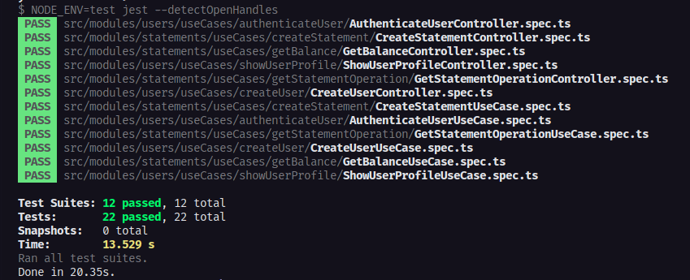

# Unit Testing and Integration - Ignite
<br>

## About

Challenge proposed during the NodeJS track at RocketSeat's Ignite bootcamp. This challenge was proposed in the fourth chapter of the trail and its objective was to consolidate the knowledge taught during module 4 of the course.

## Unit Testing and Integration

In the fourth module of the bootcamp the subject was writing unit and integration tests. We went from the general contextualization of tests to their structures and good practices.

To carry out the tests we used a financial API developed in previous modules, which contains the following routes:

<details>
  <summary>POST <code>/api/v1/users</code></summary>
  <br>
  The route receives <code>name</code>, <code>email</code> e <code>password</code> within the request body, saves the user created in the database and returns an empty response with status <code>201</code>.
</details>

<details>
  <summary>POST <code>/api/v1/sessions</code></summary>
  <br>
  The route receives <code>email</code> e <code>password</code> in the body of the request and returns the authenticated user's data along with a JWT token.
  <br><br>
  💡 This application does not have a refresh token, that is, the created token lasts only 1 day and must be recreated after the mentioned period.
</details>

<details>
  <summary>GET <code>/api/v1/profile</code></summary>
  <br>
  The route receives a JWT token through the request header and returns the authenticated user information.
</details>

<details>
  <summary>GET <code>/api/v1/statements/balance</code></summary>
  <br>
  The route receives a JWT token through the request header and returns a list of all deposit and withdrawal operations from the authenticated user and also the total balance in a <code>balance</code> property
</details>

<details>
  <summary>POST <code>/api/v1/statements/deposit</code></summary>
  <br>
  The route receives a JWT token through the header and <code>amount</code> and <code>description</code> in the request body, registers the value deposit operation and returns the deposit information created with status <code> 201</code>.
</details>

<details>
  <summary>POST <code>/api/v1/statements/withdraw</code></summary>
  <br>
  The route receives a JWT token through the header and <code>amount</code> and <code>description</code> in the body of the request, registers the withdrawal operation of the amount (if the user has a valid balance) and returns the information of the loot created with status <code>201</code>.
</details>

<details>
  <summary>GET <code>/api/v1/statements/:statement_id</code></summary>
  <br>
  The route receives a JWT token for the header and the id of a registered operation (withdrawal or deposit) in the route URL and returns the information of the found operation.
</details>

Finally, I record the results of the battery of tests implemented for the API below:



## Installation

Before starting, you will need to have the following tools installed on your machine:
[Git](https://git-scm.com), [Node.js](https://nodejs.org/en/).
Also, it's good to have an editor to work with the code like [VSCode](https://code.visualstudio.com/).

### 🎲 Rodando o Back End

### 🎲 Running the Back End

```bash
# Clone this repository
$ git clone git@github.com:MrRioja/unit-tests-ignite.git

# Access the project folder in terminal/cmd
$ cd unit-integration-ignite

# Install dependencies
$ npm install
# If you prefer to use Yarn, run the command below
$yarn

# Run the application in development mode
$ npm run dev
# If you prefer to use Yarn, run the command below
$ yarn dev

# Run the tests
$ npm run test
# If you prefer to use Yarn, run the command below
$ yarn test

# The server will start on port 3333 or on the port defined in the .env file in the APP_PORT variable - access <http://localhost:3333>
```

## Technologies


<br/>
<br/>
</div>
